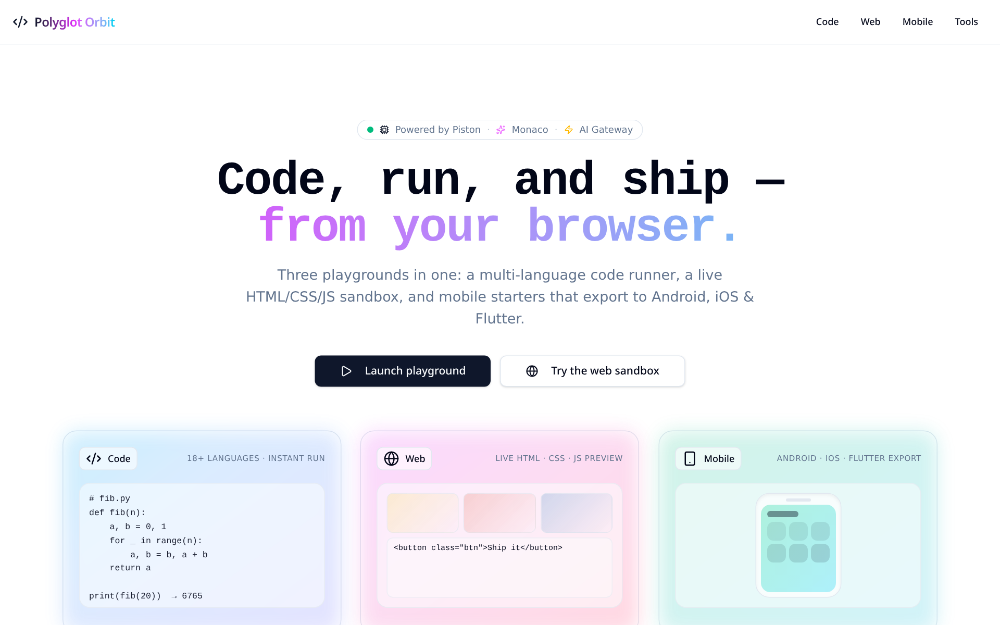
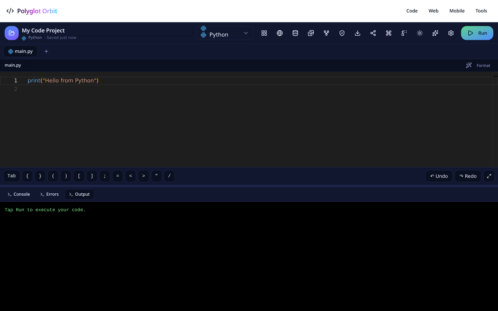

<div align="center">

# 🛰️ Polyglot Orbit

**Code · Web · Mobile — all in one browser-native playground.**

Run 18+ languages, prototype HTML/CSS/JS live, and scaffold Android / iOS / Flutter apps without leaving the tab.

<p>
  
  
  
  
  
  
  
</p>

</div>

---

## ✨ Home Page Preview

<div align="center">

<!-- Animated GIF thumbnail → opens full MP4 tour. Falls back to PNG poster if GIF is missing. -->
<a href="./docs/home.mp4" title="Watch the Polyglot Orbit tour (MP4)">
  <picture>
    <source srcset="./docs/home.gif" type="image/gif" />
    <!--  -->
  </picture>
</a>

<br /><br />

<!-- Static poster thumbnail → also opens the MP4 tour -->
<a href="./docs/home.mp4" title="Watch the Polyglot Orbit tour (MP4)">
  
</a>

<br /><br />

<a href="./docs/home.mp4">📽️ Watch the 30-second tour →</a>
&nbsp;·&nbsp;
<a href="https://github.com/">🚀 Live demo</a>

<!-- <sub>Drop <code>docs/home.gif</code>, <code>docs/home.mp4</code>, and <code>docs/home.png</code> into the repo — they render here automatically.</sub> -->

</div>

The landing page features **Polyglot Orbit** — a premium interactive 3D carousel of real brand logos. **Drag** to spin, **hover** to pause, **tap** any logo to jump straight into the matching playground.

---

## 🚀 What's Inside

| | Track | What it does |
|---|---|---|
|    | **Code** | Run **18+ languages** (Python, JS/TS, Java, C/C++, C#, Go, Rust, Ruby, PHP, Bash, Kotlin, Swift, Scala, Dart, SQL…) via the [Piston](https://github.com/engineer-man/piston) execution engine. |
|    | **Web** | Live HTML / CSS / JS / React sandbox with hot preview, shareable snapshots, and a one-click smoke test. |
|    | **Mobile** | Starter templates for **Android (Kotlin)**, **iOS (Swift)**, and **Flutter (Dart)** with one-click export. |

---

## 🧰 Supported Languages

<p align="center">
  &nbsp;
  &nbsp;
  &nbsp;
  &nbsp;
  &nbsp;
  &nbsp;
  &nbsp;
  &nbsp;
  &nbsp;
  &nbsp;
  &nbsp;
  &nbsp;
  &nbsp;
  &nbsp;
  &nbsp;
  &nbsp;
  &nbsp;
  &nbsp;
  &nbsp;
  &nbsp;
  &nbsp;
  &nbsp;
  <br /><sub>Missing a brand asset? Tiles automatically fall back across 3 CDNs and finally to a colored initials badge — no language tile is ever blank.</sub>
</p>

---

## 🎬 Playground Tour

<div align="center">

<a href="./docs/playground.mp4" title="Watch the playground tour (MP4)">
  <picture>
    <source srcset="./docs/playground.gif" type="image/gif" />
    
  </picture>
</a>

<sub>📽️ <a href="./docs/playground.mp4">Watch the playground tour →</a></sub>

</div>

---

## 🧑‍💻 How to Use the Playground

1. **Pick a language.** From the home page, tap any logo in the **Polyglot Orbit** — or use the language picker in the playground header to switch on the fly.
2. **Write code in the Monaco editor.** Multi-file projects, autosave to this device, format-on-save, and a Command Palette (`⌘K` / `Ctrl+K`).
3. **Run it.** Hit **Run** (top-right) — output streams into the console panel below. For web projects you get a live preview iframe; for mobile you get a Flutter / Android / iOS scaffold.
4. **Debug with AI.** Open the **AI Assistant** (sparkles icon) — it sees your files and runtime errors and proposes fixes.
5. **Share.** Click **Share** to copy a URL that encodes your code and the persisted preview state — open it anywhere and the playground rehydrates exactly.
6. **Export.**
   - **Code / Web** → download as ZIP.
   - **Mobile** → export to a ready-to-run **Android Studio**, **Xcode**, or **Flutter** project.
7. **Smoke-test everything.** Open **Smoke Test** to run every bundled template and see a side-by-side diff vs the previous run.

> 💡 Tip: a deep link like `/playground?lang=rust` jumps straight into Rust — Polyglot Orbit logos use these under the hood.

---

## 🧪 Built-in Smoke Test

A one-click reliability check for every bundled template.

- ✅ Loads every web **and** mobile starter
- 🔎 Reports missing CSS/JS, 404s, and runtime errors
- 🛡️ Auto-recovers from common failures (e.g. `SecurityError` → shim)
- ↔️ **Side-by-side diff** vs the previous run
- 🔁 **"Retry failed templates"** action
- 📊 Compact summary: pass rate · top error categories · last-run timestamp
- 🌐📱 Separate **web vs mobile** failure reports

Open `/playground` → click **Smoke Test** in the header.

---

## 🔗 Share Anything

The **Share** link encodes:

- Current code
- Persisted preview storage snapshot
- The "persist" toggle state

…so the read-only URL reproduces **the exact same preview state** for whoever opens it.

---

## 🛠️ Tech Stack

| Layer | Tech |
|---|---|
| Framework |  React 19 ·  Vite 7 · TanStack Start v1 |
| Language |  TypeScript (strict) |
| Styling |  Tailwind v4 · shadcn/ui · semantic design tokens |
| Editor |  Monaco Editor (VS Code engine) |
| Runtime |  Piston execution API |
| Backend |  Lovable Cloud (Postgres · Auth · Storage · Edge) |
| Deploy |  Cloudflare Workers |

---

## ⚡ Quickstart

```bash
# Install
bun install

# Dev
bun run dev          # → http://localhost:8080

# Production build
bun run build
```

---

## 📁 Project Structure

```
src/
├── routes/                    # File-based routing (TanStack Start)
│   ├── __root.tsx             # Root shell & metadata
│   ├── index.tsx              # 🏠 Landing page + Polyglot Orbit
│   ├── playground.tsx         # Multi-language code runner
│   ├── playground.web.tsx     # Live HTML/CSS/JS sandbox
│   ├── playground.mobile.tsx  # Android / iOS / Flutter starters
│   └── playground.ide.tsx     # Full IDE w/ smoke test
├── lib/playground/
│   ├── smoke-test.ts          # Template reliability runner
│   └── web-bundle.ts          # In-browser bundler
├── components/ui/             # shadcn/ui primitives
└── styles.css                 # Design tokens
```

---

## 🤝 Contributing

PRs welcome! Please:

1. Fork & branch from `main`
2. Run `bun run build` before pushing
3. Use semantic tokens (never hard-coded colors)
4. Add a smoke test entry for any new template

---

## 📄 License

[MIT](LICENSE) — free for personal and commercial use.

<div align="center">

Made with ⚡ on Vishwajeet

</div>
